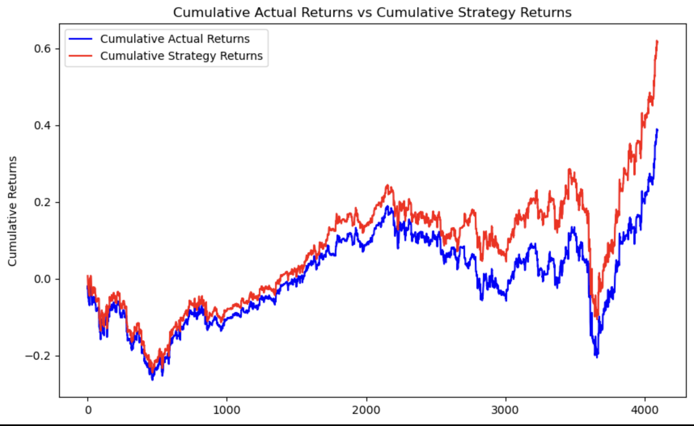
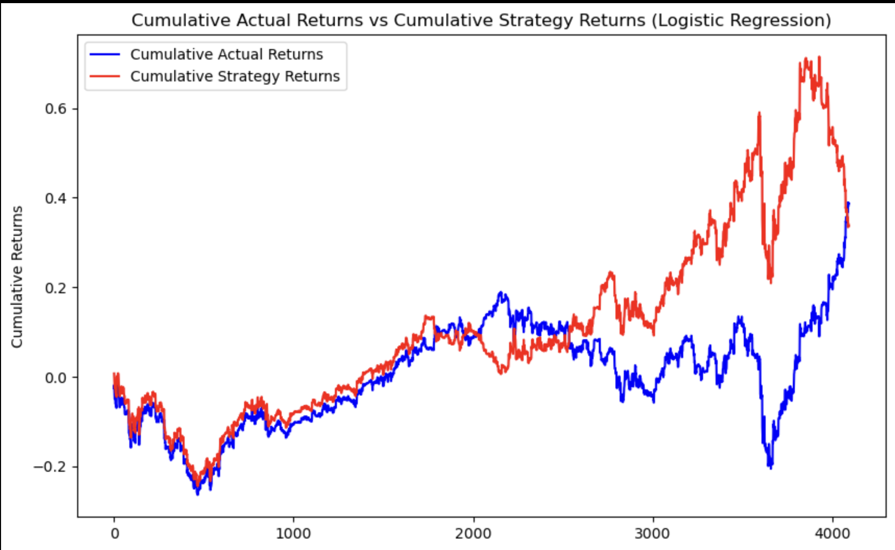
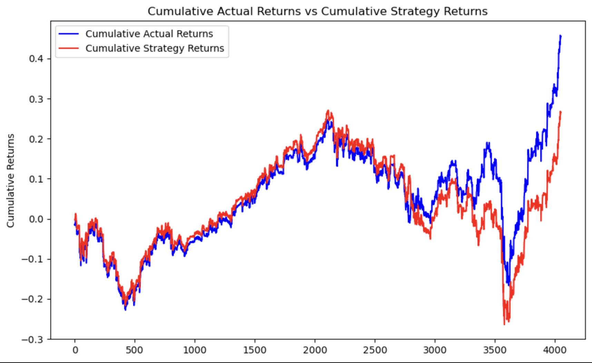
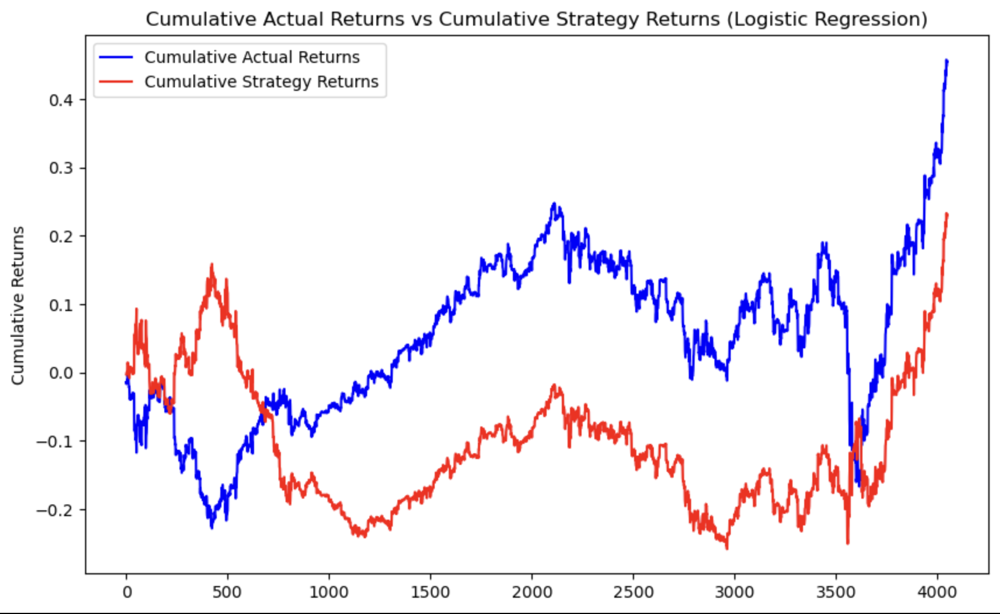
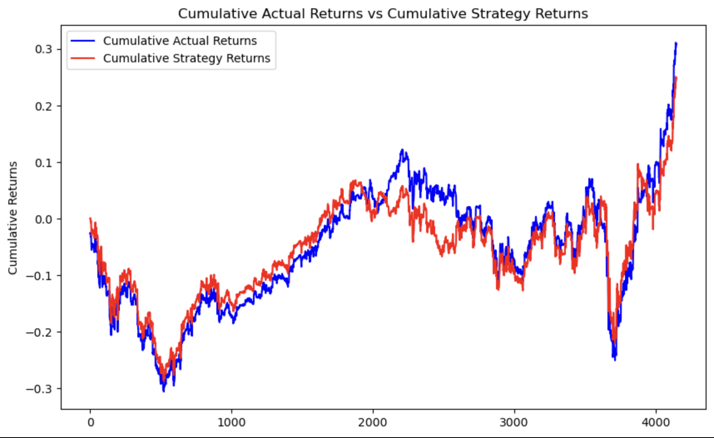
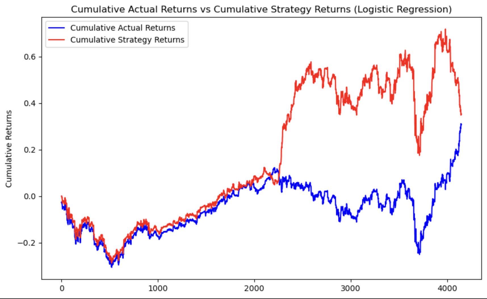

# Module_14_Challenge
## Initial Training data perion of 3 months
## Baseline Model Results
### SVC Classifier Baseline model returns

### Logistic Regression Baseline model returns

## Baseline model interpretation:
The baseline model of the SVC Classifier performed better than Logistic Regression, but in some timeframe the logistic regression has performed well bu at the end of the period of test the model did not do well. The SVC classifier has accuracy of 0.55. while Logistic Regression has better recall distribution. As show in the pictures above. 
## Training  data period of 4 months
### Model Performance after tuning
### SVC Classifier model returns

### Logistic Regression model returns

## First Tuned model interpretation:
For the first stage, tuning is done by changing the testing window by one month, totaling four months. The accuracy, recall, or the f1 score did not extensively change after tuning. However, the models performed worse than the baseline model. This might be due to how the model’s algorithm works both SVC and logistic regression. As show in the pictures above. 
## Training  data for short window of 5 and long window of 40
### Model Performance after tuning
### SVC Classifier model returns

### Logistic Regression model returns

## Second Tuned model interpretation:
For second stage of tuning, the short and long window were adjested to 5 and 40 respectively. The SVC clasifier model unferformed its baseline model, and has a lower acuracy score compared to the same by 1 point. While the Logistic regression model performed slightly better compared with the baseline model. As show in the pictures above.  

## Analysis Conclusion:
Model Choice:
Between the two models, Logistic Regression demonstrates slightly better performance consistency and benefits more from tuning than the SVC Classifier.
In summary, while neither model showed dramatic improvements with the current tuning strategies, Logistic Regression exhibited better overall potential. Future efforts should focus on refining model inputs and exploring alternative machine learning techniques to achieve more substantial performance gains.